# Foundation Contract — Hitopia Monitoring & Monthly Report

<!--
  Output: Planning Agent (DRAFT) -> DIBEKUKAN oleh CTO (manusia) setelah Gerbang 2.
  JANGAN dibekukan oleh agent. Setelah freeze: rename ke foundation.frozen.md, READ-ONLY (R4).
  Acuan TUNGGAL semua modul implementasi paralel.
-->

```
Proyek    : Hitopia Monitoring & Monthly Report
Versi     : v1 (draft)
Status    : DRAFT
Di-freeze : <nama CTO> · <YYYY-MM-DD> · <git tag/hash>   # diisi MANUSIA saat freeze
```

## Prinsip kontrak
- Setelah FROZEN, file ini read-only. Perubahan hanya lewat approval CTO + update PRD modul terdampak (R4).
- Semua modul merujuk kontrak ini; tidak ada modul yang mendefinisikan ulang skema.
- **Read-only ke sumber eksternal** (tak ada write-back Jira/Clockify/Sheet). Aplikasi menulis hanya entitas
  turunan/operasionalnya sendiri (registry, mapping, metrik, skor, lead assessment, insight, report, approval, audit).
- 🔴 Banyak entitas adalah **data pribadi / performa individu** → modul yang menyentuhnya WAJIB Gerbang 3.

> **Catatan draft — perlu dijernihkan SEBELUM freeze (Gerbang 1/2):**
> (a) **identity-mapping key** kanonik lintas-sistem; (b) **sumber & bentuk cost rate**; (c) konfirmasi jam kerja
> standar; (d) kalibrasi bobot/threshold scoring. Skema di bawah dirancang fleksibel terhadap (a)–(d) tetapi
> field-nya bisa berubah setelah konfirmasi. Lihat `spec/prd.md` → Open questions.

## Data model (ERD)

```mermaid
erDiagram
  TALENT ||--o{ IDENTITY_MAPPING : "punya identitas eksternal"
  TALENT ||--o{ UTILIZATION_RECORD : "per periode"
  TALENT ||--o{ DELIVERY_RECORD : "per periode"
  TALENT ||--o{ LEAD_ASSESSMENT : "dinilai lead"
  TALENT ||--o{ PERFORMANCE_SCORE : "skor per periode"
  TALENT ||--o{ BUDGET_BURN : "per periode"
  TALENT ||--o{ INSIGHT : "diagnosis per periode"
  TALENT }o--o{ PROJECT : "ditugaskan via TALENT_PROJECT"
  PROJECT ||--o{ TALENT_PROJECT : ""
  TALENT ||--o{ TALENT_PROJECT : ""
  SCORING_CONFIG ||--o{ PERFORMANCE_SCORE : "versi bobot/threshold"
  COST_RATE ||--o{ BUDGET_BURN : "rate dipakai"
  INGESTION_RUN ||--o{ UTILIZATION_RECORD : "sumber"
  INGESTION_RUN ||--o{ DELIVERY_RECORD : "sumber"
  INGESTION_RUN ||--o{ DATA_QUALITY_FLAG : "temuan"
  MONTHLY_REPORT ||--o{ REPORT_ITEM : "berisi"
  MONTHLY_REPORT ||--o{ APPROVAL : "di-review"
  INSIGHT ||--o{ APPROVAL : "di-review"
  APP_USER ||--o{ APPROVAL : "memutuskan"
  APP_USER ||--o{ AUDIT_LOG : "aktor"

  TALENT {
    uuid id PK
    string full_name
    string email
    string division
    string role
    string employment_type
    string status "active|inactive"
    uuid primary_project_id FK "nullable"
    timestamp created_at
    timestamp updated_at
  }
  IDENTITY_MAPPING {
    uuid id PK
    uuid talent_id FK
    string system "gsheet|jira|clockify"
    string external_id
    string external_display_name
    string confidence "high|medium|low"
    boolean verified
    uuid verified_by FK "APP_USER, nullable"
    timestamp verified_at "nullable"
  }
  PROJECT {
    uuid id PK
    string name
    string client_name
    string jira_project_key "nullable"
    string clockify_project_id "nullable"
    decimal budget_amount "nullable"
    string currency "nullable"
  }
  TALENT_PROJECT {
    uuid id PK
    uuid talent_id FK
    uuid project_id FK
    string period "YYYY-MM, nullable"
  }
  INGESTION_RUN {
    uuid id PK
    string source "gsheet|jira|clockify"
    string period "YYYY-MM"
    string status "pending|running|success|partial|failed"
    timestamp started_at
    timestamp finished_at "nullable"
    int records_ingested
    json quality_summary "nullable"
  }
  DATA_QUALITY_FLAG {
    uuid id PK
    uuid ingestion_run_id FK
    uuid talent_id FK "nullable"
    string severity "info|warn|block"
    string code
    string message
  }
  UTILIZATION_RECORD {
    uuid id PK
    uuid talent_id FK
    string period "YYYY-MM"
    uuid project_id FK "nullable"
    decimal tracked_hours
    decimal productive_hours
    decimal target_hours
    decimal overtime_hours
    uuid source_run_id FK
  }
  DELIVERY_RECORD {
    uuid id PK
    uuid talent_id FK
    string period "YYYY-MM"
    int tickets_committed
    int tickets_completed
    int tickets_overdue
    int tickets_reopened
    decimal avg_aging_days
    uuid source_run_id FK
  }
  COST_RATE {
    uuid id PK
    string scope "talent|role"
    string ref_id "talent_id atau nama role"
    decimal rate_amount
    string currency
    date effective_from
    string source
  }
  BUDGET_BURN {
    uuid id PK
    uuid talent_id FK
    string period "YYYY-MM"
    uuid project_id FK "nullable"
    decimal cost_incurred
    decimal budget_allocated "nullable"
    decimal burn_pct "nullable"
    uuid cost_rate_id FK
    timestamp computed_at
  }
  LEAD_ASSESSMENT {
    uuid id PK
    uuid talent_id FK
    string period "YYYY-MM"
    string lead_ref
    json rubric_scores
    decimal normalized_score "0-100"
    string comment "nullable"
    uuid submitted_by FK "APP_USER"
    timestamp submitted_at
  }
  SCORING_CONFIG {
    uuid id PK
    int version
    json weights "delivery,utilization,efficiency,overtime,lead"
    json thresholds "low,needs_review,healthy"
    date effective_from
    uuid created_by FK "APP_USER"
    timestamp created_at
  }
  PERFORMANCE_SCORE {
    uuid id PK
    uuid talent_id FK
    string period "YYYY-MM"
    decimal delivery_score
    decimal utilization_score
    decimal efficiency_score
    decimal overtime_health_score
    decimal lead_assessment_score
    decimal total_score "0-100"
    string flag "low|needs_review|healthy"
    uuid scoring_config_id FK
    timestamp computed_at
  }
  INSIGHT {
    uuid id PK
    uuid talent_id FK
    string period "YYYY-MM"
    json diagnosis "penyebab + bobot"
    string narrative
    json recommendations
    json source_refs "metrik/periode yang dirujuk"
    string model_id
    string status "generated|in_review|approved|rejected"
    timestamp generated_at
  }
  MONTHLY_REPORT {
    uuid id PK
    string period "YYYY-MM"
    json scope "talent/project/client tercakup"
    string status "draft|in_review|approved|published"
    string audience "internal|client"
    string exec_summary "nullable"
    string file_ref "nullable"
    uuid generated_by FK "APP_USER"
    timestamp created_at
  }
  REPORT_ITEM {
    uuid id PK
    uuid monthly_report_id FK
    uuid talent_id FK "nullable"
    uuid insight_id FK "nullable"
    string section
    json content
    boolean client_visible
  }
  APPROVAL {
    uuid id PK
    string subject_type "insight|monthly_report"
    uuid subject_id
    uuid reviewer_id FK "APP_USER"
    string decision "approve|reject|request_changes"
    string comment "nullable"
    timestamp decided_at
  }
  APP_USER {
    uuid id PK
    string email
    string name
    string role "admin|analyst|reviewer|viewer"
    string status "active|disabled"
    timestamp created_at
  }
  AUDIT_LOG {
    uuid id PK
    uuid actor_user_id FK "nullable"
    string action
    string entity_type
    uuid entity_id "nullable"
    json metadata "nullable, redaksi data sensitif"
    string ip "nullable"
    timestamp created_at
  }
```


> **APP_USER ≠ TALENT.** `APP_USER` = pengguna aplikasi internal (auth/RBAC). `TALENT` = subjek data yang dinilai.
> Keduanya terpisah tegas.

## Kontrak API
<!-- Read-only ke sumber eksternal. Endpoint di bawah adalah API aplikasi sendiri. Semua butuh auth + RBAC. -->

| Operasi | Method/Path | Request | Response | Error |
|---|---|---|---|---|
| Login (SSO) | `POST /auth/login` | `{ provider }` | `{ token, user }` | 401 |
| Profil sendiri | `GET /me` | — | `{ user }` | 401 |
| List talent | `GET /talents?period=&flag=&page=&limit=` | — | `{ data:[Talent], meta }` | 401/403 |
| Detail talent | `GET /talents/{id}` | — | `{ talent, mappings }` | 403/404 |
| Mapping belum terselesaikan | `GET /mappings/unresolved` | — | `{ data:[IdentityMapping] }` | 403 |
| Verifikasi mapping | `POST /mappings/{id}/verify` | `{ external_id }` | `{ mapping }` | 403/409 |
| Trigger ingestion (admin) | `POST /ingestion/runs` | `{ source, period }` | `{ run }` | 403/409 |
| List ingestion run | `GET /ingestion/runs?source=&period=` | — | `{ data:[IngestionRun] }` | 403 |
| Detail run + quality | `GET /ingestion/runs/{id}` | — | `{ run, quality_flags }` | 403/404 |
| Metrik talent | `GET /talents/{id}/metrics?period=` | — | `{ utilization, delivery, budget_burn }` | 403/404 |
| Skor (list) | `GET /scores?period=&flag=` | — | `{ data:[PerformanceScore], meta }` | 403 |
| Skor talent | `GET /talents/{id}/scores?period=` | — | `{ data:[PerformanceScore] }` | 403/404 |
| Baca config scoring | `GET /scoring-config` | — | `{ current, versions }` | 403 |
| Ubah config scoring (admin) | `PUT /scoring-config` | `{ weights, thresholds, effective_from }` | `{ config }` (versi baru) | 403/422 |
| Submit lead assessment | `POST /lead-assessments` | `{ talent_id, period, rubric_scores, comment }` | `{ assessment }` | 403/422 |
| List lead assessment | `GET /lead-assessments?period=` | — | `{ data:[LeadAssessment] }` | 403 |
| Insight talent | `GET /talents/{id}/insights?period=` | — | `{ data:[Insight] }` | 403/404 |
| Generate insight (admin/analyst) | `POST /insights/generate` | `{ period, talent_ids? }` | `{ jobId }` | 403/409 |
| List report | `GET /reports?period=&status=` | — | `{ data:[MonthlyReport], meta }` | 403 |
| Detail report | `GET /reports/{id}` | — | `{ report, items }` | 403/404 |
| Generate report | `POST /reports/generate` | `{ period, scope }` | `{ report }` (draft) | 403/409 |
| Submit untuk review | `POST /reports/{id}/submit` | — | `{ report }` (in_review) | 403/409 |
| Approve | `POST /reports/{id}/approve` | `{ comment? }` | `{ approval, report }` | 403/409 |
| Reject / minta perubahan | `POST /reports/{id}/reject` | `{ comment }` | `{ approval, report }` | 403/409 |
| Ekspor deck (hanya approved) | `GET /reports/{id}/export` | — | `file (pdf/pptx)` | 403/409 |
| Audit log (admin) | `GET /audit-logs?entity=&actor=&page=` | — | `{ data:[AuditLog], meta }` | 403 |

## Konvensi
- **ID:** UUID v4. **Timestamp:** ISO-8601, UTC. **Periode bulanan:** `YYYY-MM`.
- **Error baku:** `{ "error": { "code": string, "message": string, "details": object? } }` + HTTP status (4xx klien, 5xx server).
- **Pagination:** query `page` (default 1), `limit` (default 25); respons `meta:{page,limit,total}`.
- **Auth:** semua endpoint butuh auth kecuali `/auth/login`. RBAC ditegakkan server-side; aksi tertentu admin-only.
- **Penamaan:** kolom/tabel `snake_case`; payload JSON `snake_case` konsisten.
- **Idempotensi ingestion:** `POST /ingestion/runs` per `(source, period)` aman diulang; menggantikan/menandai run lama.

## Aturan data sensitif
🔴 Field PDP / performa individu — modul yang menyentuh ini WAJIB Gerbang 3:
- **PII talent:** `TALENT.full_name`, `email`, `division`, `role`, `employment_type` — minimisasi & enkripsi at rest.
- **Performa individu:** `PERFORMANCE_SCORE.*`, `LEAD_ASSESSMENT.*`, `INSIGHT.*` — akses RBAC ketat, audit penuh.
- **Pemisahan internal vs client:** `REPORT_ITEM.client_visible` & `MONTHLY_REPORT.audience` menegakkan bahwa
  konten sensitif **tidak** masuk deck client kecuali eksplisit di-approve.
- **Retensi & hak subjek data:** kebijakan retensi per entitas; mekanisme akses/koreksi/hapus subjek data.
- **Audit:** setiap akses/aksi material ke entitas sensitif → `AUDIT_LOG` (metadata diredaksi dari nilai sensitif).
- **Secret:** credential sumber eksternal hanya via secret manager/env (`JIRA_BASE_URL`, `JIRA_EMAIL`,
  `JIRA_API_TOKEN`, `CLOCKIFY_API_KEY`, kredensial Google) — tidak pernah di tabel/log/report/prompt.
  Credential exposed di chat **di-rotate** sebelum integrasi production.

## Changelog kontrak
<!-- Diisi setelah v1: tanggal · apa · siapa approve · PRD terdampak. -->
- v1 (draft) — <YYYY-MM-DD> — draft awal oleh Planning Agent. Belum FROZEN.

---
*Nafanesia — Template Foundation Contract v1.0*
